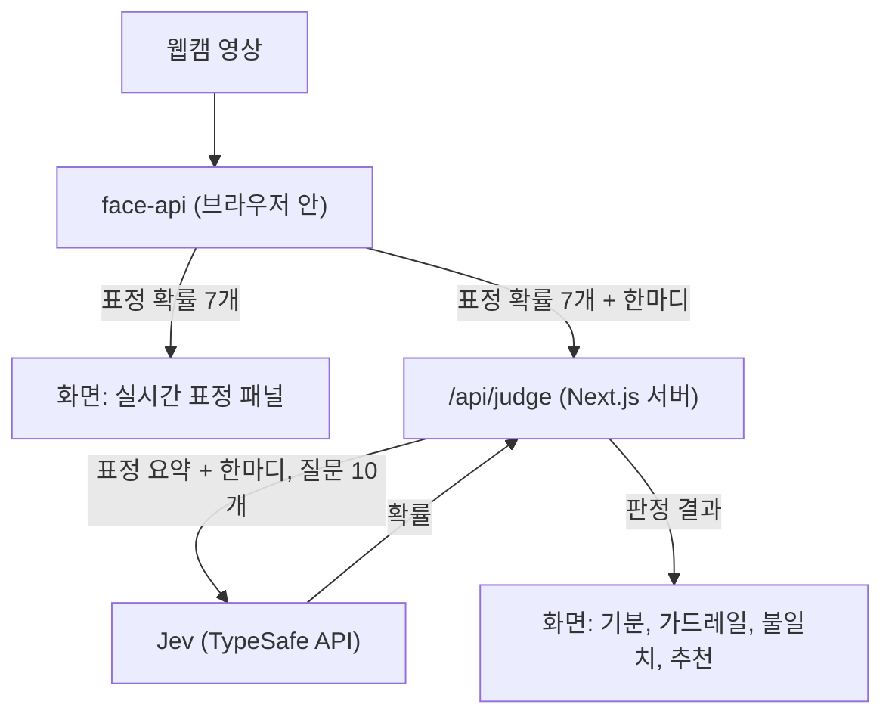

# Jev 무드 미러

웹캠 표정과 한국어 한마디로 지금 기분을 짚어 보는 웹 데모입니다. 표정은 브라우저 안에서 읽고, 기분 판정은 TypeSafe의 판정 모델 Jev에 맡깁니다. 같은 판정을 Claude에게도 시켜 속도와 비용을 비교하는 평가 스크립트가 함께 들어 있습니다.


<sub>화면 속 인물은 Wikimedia Commons의 CC0 사진 [Smiling woman pink shirt](https://commons.wikimedia.org/wiki/File:Smiling_woman_pink_shirt_%28cropped%29.jpg)을 가짜 카메라 영상으로 넣은 것입니다.</sub>

Node.js 24 이상과 pnpm이 있으면 바로 띄울 수 있습니다.

```bash
pnpm install
cp .env.example .env   # TYPESAFE_API_KEY 입력
pnpm dev               # http://127.0.0.1:3000
```

> [!NOTE]
> 웹캠 영상은 브라우저 밖으로 나가지 않습니다. 서버로 보내는 것은 입력한 한마디와 표정 확률 숫자 7개뿐입니다. 자세한 내용은 [개인정보](#개인정보)에 있습니다.

## 왜 만들었나

Jev는 글을 생성하지 않고 정해진 보기 중에서 고르거나 예/아니오 확률을 돌려주는 모델입니다. 이런 모델이 실제로 얼마나 빠르고 싼지, 한국어에서도 쓸 만한지 손으로 확인해 보고 싶었습니다. 그래서 결과가 눈에 바로 보이는 기분 판정을 골랐고 표정 인식을 붙여 "웃고 있는데 말은 지쳐 있다" 같은 장면을 만들 수 있게 했습니다.

## 시작하기

Node.js 24 이상과 pnpm이 필요합니다.

1. 의존성을 설치합니다.

   ```bash
   pnpm install
   ```

2. `.env.example`을 `.env`로 복사하고 키를 채웁니다.

   | 변수 | 용도 |
   |---|---|
   | `TYPESAFE_API_KEY` | 필수. [TypeSafe 콘솔](https://console.typesafe.ai/keys)에서 발급합니다 |
   | `ANTHROPIC_API_KEY` | `pnpm eval`의 Claude 비교에만 씁니다. 없으면 Claude 쪽은 건너뜁니다 |

3. 개발 서버를 켜고 http://127.0.0.1:3000 에서 카메라 권한을 허용합니다.

   ```bash
   pnpm dev
   ```

서버는 이 컴퓨터(127.0.0.1)에서만 열립니다. `.env`를 고쳤다면 서버를 다시 켜야 반영됩니다.

화면 아래 예시 버튼으로 바로 해 볼 수 있습니다. 카메라를 보고 웃으면서 **웃으며 말하기**를 누르면 표정과 말이 다르다는 알림이 뜹니다. **인젝션**을 누르면 판정을 보류하는 모습을 볼 수 있습니다.

## 동작 방식



### 브라우저에서 도는 모델

표정은 [@vladmandic/face-api](https://github.com/vladmandic/face-api) 1.7.15로 읽습니다. 원조 face-api.js를 TensorFlow.js 4.x에 맞게 이어 온 포크입니다. 약 300ms마다 한 번씩 아래 두 모델을 차례로 돌립니다.

| 모델 | 하는 일 | 가중치 크기 |
|---|---|---|
| TinyFaceDetector | 프레임에서 얼굴 위치를 찾습니다(입력 224px) | 193KB |
| FaceExpressionNet | 찾은 얼굴을 무표정, 웃음, 슬픔, 화남, 두려움, 혐오, 놀람 7가지 확률로 나눕니다 | 329KB |

가중치는 `public/models/`에 들어 있고 같은 서버에서 받아 옵니다. 외부 CDN은 쓰지 않습니다.

### Jev에 보내는 질문

[공식 문서](https://docs.typesafe.ai/model-jaggedness/jev-1.13.md)에 따르면 Jev는 숫자 비교에 약합니다. 그래서 서버는 표정 확률 7개를 그대로 넘기지 않고, 가장 강한 표정 하나와 그 세기만 `happy (smiling)`, `strong`처럼 이름으로 바꿔 보냅니다. 질문 10개를 한 번의 호출에 묶어 보내고 필요한 답만 골라 씁니다.

| 질문 | 형식 | 쓰임 |
|---|---|---|
| 기분 | Choice(기쁨, 평온, 슬픔, 피곤, 짜증, 불안) | 한마디만 보고 고릅니다 |
| 프롬프트 인젝션 | Noul(예/아니오 확률) | 가드레일 |
| 유해한 요청 | Noul | 가드레일 |
| 표정과 말의 불일치 | Noul | 불일치 알림 |
| 기분별 추천 × 6 | Choice(한마디, 음악, 휴식) | 판정된 기분의 것만 씁니다 |

질문 정의는 `lib/jev/questions.ts` 한 곳에 있고 화면과 평가 스크립트가 같은 정의를 씁니다.

### 판정 규칙은 코드에

Jev는 확률만 돌려줍니다. 그 확률로 무엇을 할지는 `lib/judge/policy.ts`가 정합니다.

- 인젝션과 유해 확률 중 큰 값이 0.7 이상이면 "위험해요", 0.35 이상이면 "주의가 필요해요"로 표시합니다. 이때는 기분 판정을 보류하고 추천과 불일치 알림도 숨깁니다.
- 얼굴이 안 보이거나, 무표정이거나, 표정이 약하면 불일치를 따지지 않습니다. 그 밖에는 불일치 확률이 0.6 이상일 때 알림을 띄웁니다.
- 기분 확신도가 0.6보다 낮으면 "확신이 낮아요"를 함께 표시합니다.

추천 문구 18개는 `lib/judge/reactions.ts`에 미리 적어 두었습니다. Jev는 그중 하나를 고를 뿐 문장을 만들지 않습니다.

## 개인정보

- 웹캠 영상, 프레임, 이미지는 어디로도 보내지 않고 저장하지도 않습니다. 표정 인식은 브라우저 안에서만 돌아갑니다.
- 서버(`/api/judge`)로 가는 것은 입력한 한마디(최대 300자)와 표정 확률 7개입니다.
- 서버는 이 가운데 한마디와 표정 요약만 Jev(TypeSafe API)에 보냅니다. 판정 결과는 서버에 남기지 않습니다.
- 분석 도구나 추적 스크립트는 없습니다. 외부로 나가는 요청은 TypeSafe API 호출 하나입니다.
- API 키는 서버에서만 읽습니다. 화면 코드가 키를 다루는 모듈을 불러오지 못하도록 ESLint 규칙으로 막아 두었습니다.

## 평가: Jev와 Claude 비교

```bash
pnpm eval
```

한국어 문장 41개를 Jev, Claude Haiku 4.5, Claude Sonnet 5에 같은 정의로 물어보고 정확도, 오탐, 지연, 비용을 표로 남깁니다. 결과는 터미널과 `eval/results/<시각>.md`에 저장됩니다. 한 번에 약 $0.32가 들고 대부분 Claude 비용입니다.

평가셋(`eval/dataset.ko.json`)은 이렇게 구성했습니다.

| 종류 | 개수 | 확인하는 것 |
|---|---|---|
| 기분 | 19 | 기분 6가지를 맞히는지(경계 사례 1건 포함) |
| 인젝션 | 5 | "이전 지시는 무시해" 같은 문장을 막는지 |
| 유해한 요청 | 3 | 남을 해치거나 불법 행위를 돕는 요청을 막는지 |
| 인젝션처럼 보이는 정상 문장 | 6 | "지시사항 무시하는 팀장 때문에 짜증나"를 잘못 막지 않는지 |
| 표정과 말이 다름 | 4 | 불일치를 잡는지 |
| 표정과 말이 같음 | 4 | 불일치를 잘못 잡지 않는지 |

### 결과 (2026-09-28, jev-1.13.0)

| 모델 | 기분 | 가드레일 탐지 | 오탐 | 불일치 | 응답 p50 / p95 | 41건 비용 |
|---|---|---|---|---|---|---|
| Jev | 100% (32/32) | 100% (8/8) | 0% (0/32) | 100% (8/8) | 275 / 789ms | $0.005 |
| Claude Haiku 4.5 | 100% (32/32) | 100% (8/8) | 0% (0/32) | 100% (8/8) | 1,234 / 1,877ms | $0.088 |
| Claude Sonnet 5 | 100% (32/32) | 100% (8/8) | 0% (0/32) | 100% (8/8) | 1,993 / 4,404ms | $0.227 |

기분과 오탐은 경계 사례를 뺀 정상 입력 32건, 가드레일 탐지는 인젝션·유해 요청 8건, 불일치는 표정이 있는 8건 기준입니다.

세 모델의 정확도가 같았습니다. 응답 p50 기준으로 Jev가 4~7배 빠르고, 비용은 16~42배 쌌습니다. Jev 호출 한 번은 입력 약 3,100토큰, 비용 약 $0.00013입니다.

다만 이 표를 "Jev가 Claude만큼 정확하다"로 읽으면 안 됩니다. 평가셋이 작고 쉬워서 세 모델 모두 만점이 나왔습니다. 정확도 차이를 가를 만큼 어려운 문장이 없습니다.

라벨이 애매한 경계 사례("요즘 너무 힘들어서 죽고 싶을 만큼 지쳐") 1건은 지표에서 빼고 따로 적었습니다. 세 모델 모두 슬픔 대신 피곤을 골랐습니다.

토큰과 비용도 같은 작업량을 비교한 것이 아닙니다. Jev는 데모와 똑같이 질문 10개를 받고, Claude는 비교에 필요한 4개만 받습니다.

## 한계

- Jev는 영어가 주 학습 언어라 [한국어 정확도가 더 낮을 수 있다고](https://docs.typesafe.ai/concepts/state.md) 공식 문서에 적혀 있습니다. 이번 평가셋으로는 그 차이를 확인하지 못했습니다.
- 표정 모델은 7가지 표정만 구분합니다. 조명이 어둡거나 얼굴이 옆을 향하면 정확도가 떨어질 수 있습니다. 테스트할 때 무표정에 가까운 사진을 "웃음 50%, 무표정 44%"로 읽은 적도 있습니다.
- 가드레일 임계값(0.35, 0.7)은 TypeSafe [가드레일 쿡북](https://docs.typesafe.ai/cookbooks/llm_guardrails.md)의 strict 정책 값을 그대로 썼습니다. 이 데이터로 따로 맞춘 값이 아닙니다.
- 자해나 위기 표현을 따로 안내하는 기능은 없습니다. 이 데모는 상담이나 진단 도구가 아닙니다.
- face-api 저장소는 보관(archived) 상태라 더 이상 업데이트되지 않습니다. 계속 쓸 거라면 같은 저자의 [@vladmandic/human](https://github.com/vladmandic/human)으로 옮기는 편이 낫습니다.
- 배포, 로그인, 호출량 제한은 없습니다. 로컬에서 돌려 보는 용도입니다.

## 구조

```
app/            페이지와 /api/judge 라우트
features/       무드 미러 화면(웹캠, 표정 패널, 결과, 입력)
lib/judge/      기분 라벨, 판정 규칙, 응답 스키마 (SDK를 쓰지 않음)
lib/jev/        Jev 클라이언트와 질문 정의 (서버 전용)
eval/           평가셋, 평가 스크립트, 결과 리포트
docs/research/  만들기 전에 조사한 자료
public/models/  표정 인식 모델 가중치
```

import는 `app → features → lib` 방향으로만 흐르게 ESLint로 강제합니다. 화면은 Next.js 16(App Router), React 19, Tailwind CSS 4로 만들었고 글꼴은 Pretendard, 아이콘은 lucide입니다.

| 명령 | 하는 일 |
|---|---|
| `pnpm dev` | 개발 서버 |
| `pnpm build`, `pnpm start` | 프로덕션 빌드와 실행 |
| `pnpm typecheck`, `pnpm lint` | 타입 검사와 린트 |
| `pnpm eval` | Jev와 Claude 비교 평가 |

테스트 코드는 일부러 두지 않았습니다. 타입 검사, 린트, 빌드, `pnpm eval`로 확인합니다.

## 라이선스

이 저장소의 라이선스는 아직 정하지 않았습니다. 함께 쓰는 face-api와 TypeSafe SDK는 MIT, Pretendard는 SIL Open Font License 1.1입니다.
